# Math 338 Lab 24 Fall 2019

In this lab, we will investigate the importance of evaluating whether
the assumptions of the Simple Linear Regression Model are met. We will
work with a dataset called *anscombe*, which actually contains four (x,
y) datasets that you will find have the same statistical properties, but
are VERY different.

```r
as <- anscombe
library(ggplot2)
old_x1y1_plot <- ggplot(as, mapping = aes(x = x1, y = y1)) + geom_point()
lm_x1y1 <- lm(y1 ~ x1, data = as)
coef_x1y1 <- coef(lm_x1y1)
new_x1y1_plot <- old_x1y1_plot + geom_abline(intercept = coef_x1y1[1], slope = coef_x1y1[2])
print(new_x1y1_plot)
```

**Question 1** Insert the final plot below.

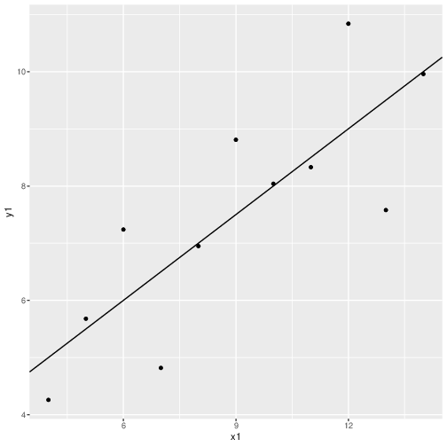{width=50%}

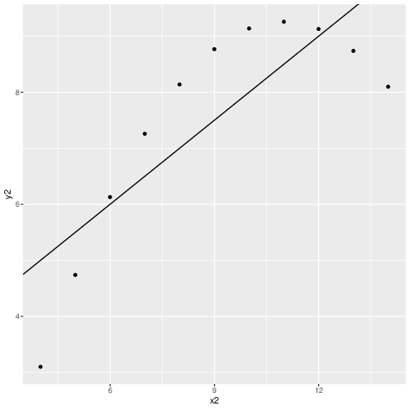{width=50%}

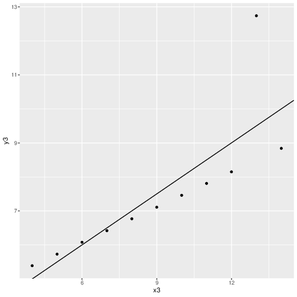{width=50%}

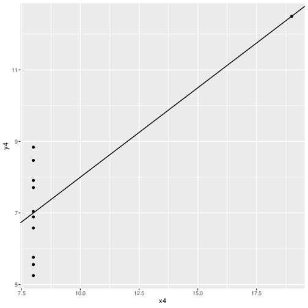{width=50%}

\newpage

**Question 2** Use the ***summary()*** command to learn more about
your linear model. Insert the ***Coefficients:*** table from the summary
below.

```
Coefficients:
            Estimate Std. Error t value Pr(>|t|)   
(Intercept)   3.0001     1.1247   2.667  0.02573 * 
x1            0.5001     0.1179   4.241  0.00217 **

```

**Question 3:** Write out the equation of the least-squares regression
line for x1 and y1 using the intercept and slope estimates given in the
output. Round your estimates to 2 decimal places and remember to use the
actual names of the variables when writing out the equation.

$$y\textsubscript{1} = 3.00 + 0.50x\textsubscript{1}$$

**Question 4** What is the observed value of the t-statistic for the
hypothesis test for the slope parameter? Show how you can compute it
from the values of b~1~ and SE~b1~.

- The observed value of the t-statistic is estimate error over standard error which is going to be $\frac{0.5001}{0.1179} = 4.241$

\newpage

**Question 5** What is the p-value associated with the hypothesis test
for the slope? At the 5% significance level, what can you conclude about
the slope?

- The p-value is going to be $0.00217$ and at an $\alpha$ value of 0.05, we can conclude that the slope is not zero.

**Question 6** What is the value of the coefficient of determination?

- Coefficient of determination is $0.6665$

Now, let's look at the residual plot.

**Question 7** Insert the plot below. Do the residuals look healthy
(roughly scattered around 0 with no obvious pattern or "fanning")?

- The residual is healthy because it does not rely on $\hat{y}$

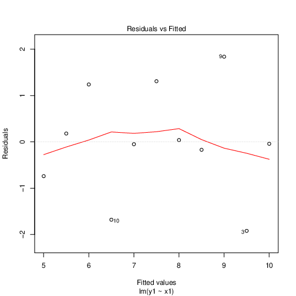{width=50%}

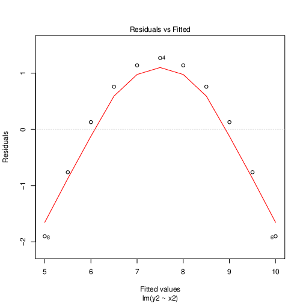{width=50%}

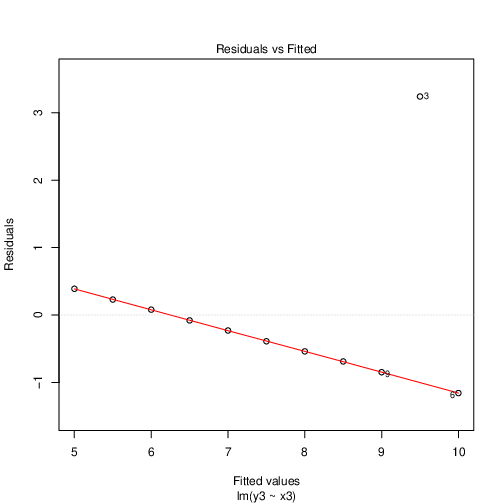{width=50%}

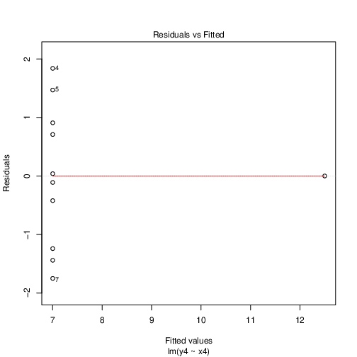{width=50%}


We can also look at the normal q-q plot to assess normality.

\newpage

**Question 8** Insert the plot below. Do the residuals look
approximately normal?

- The residual looks approximately normal since it is in fact linear.

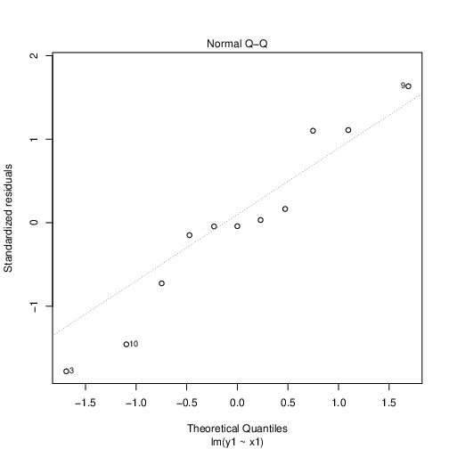{width=60%}

{width=60%}

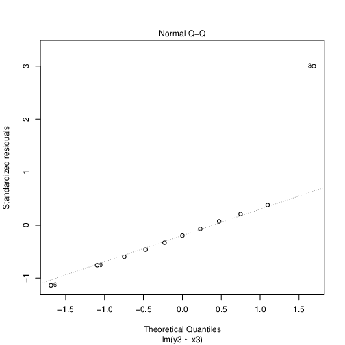{width=60%}

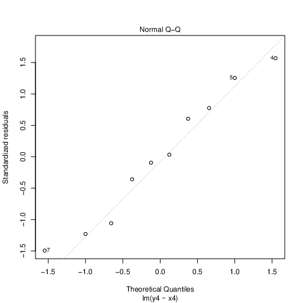{width=60%}

\newpage

**Question 9** [Repeat questions 1-8 for the other three
datasets]{.underline}: x2-y2, x3-y3, and x4-y4. (You can put your
answers with the corresponding question.) You should find that using
linear regression with x2-y2 is obviously a bad idea. **Should linear
regression be used to model the x3-y3 relationship? What about x4-y4?
Justify your answer.**

- For x3-y3, yes the regression line should be used since the points are close to the line even though there are outliers
- For x4-y4, however, the regression line should not be used because there is a vertical line, implying there is no slope.

**Question 10** Why is it important to look at the scatterplot and
residual plots? Why can't we just look at the least-squares regression
line, r^2^, and the p-value?


- By looking at the data plotted out, you can see if there is a need to use a linear regression line or not. Both the R\textsuperscript{2} and the p-value can be the same for different datasets and is not consistent.
