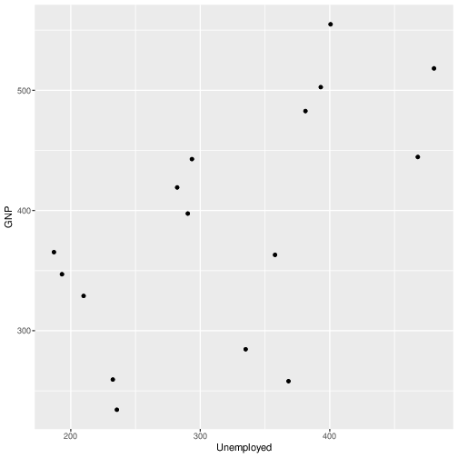
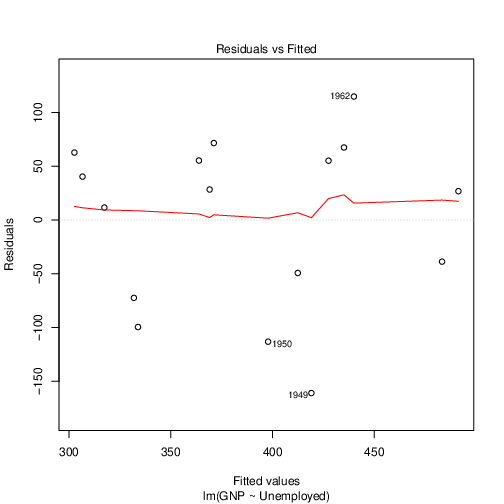

Jared Dyreson


# Math 338 Lab Assignment 25 Fall 2019

For this lab, we will perform several different types of inference for
simple linear regression. We will work with two variables from the
*longley* dataset in RStudio, which describe a total of seven
macroeconomic variables observed yearly from 1947 to 1962.


We could explore many different relationships among the seven variables.
For now, we will focus on the Gross National Product (GNP) as a linear
function of the number of unemployed (Unemployed).

```r
summary(longley)
```

**Question 1** Create a scatterplot of the two variables (with the
response on the y-axis and the predictor on the x-axis) using the
***ggplot()*** and ***geom\_point()*** commands. Insert the plot below.

{width=50%}

**Question 2** Does there appear to be a linear relationship between
GNP and Unemployed? If so, comment on the strength of the relationship.

Now, let's obtain the linear model for these data.

\textcolor{red}{There appears to be a linear relationship because the data points seem to be equally spaced between the regression line. However it is not particularly strong.}

```r
longley_lm <- lm(GNP ~ Unemployed, data = data)
summary(longley_lm)

```

**Question 3** Copy and paste the **Coefficients:** table below. Use
the estimates in the table to write the least-squares regression
equation.

```
Coefficients:
            Estimate Std. Error t value Pr(>|t|)  
(Intercept) 182.4558    75.1778   2.427   0.0293 *
Unemployed    0.6427     0.2265   2.838   0.0132 *
```
\hl{$y = 0.6427x + 182.4558$}

\newpage

**Question 4** Using your least-squares regression equation, predict
the GNP when Unemployment is at 187.

$x = 187$

\hl{$y = 0.6427 \times 187 + 182.4588 = 302.6407$}


**Question 5** Write the null and alternative hypothesis for the
(NHST-framework) hypothesis test for the slope parameter. Also, write
the (null) hypothesis associated with the ANOVA table.

\textbf{NHST}

- \textcolor{red}{H\textsubscript{o}: \underline{$\beta\textsubscript{1} = 0$ which means there is no linear relationship}}
- \textcolor{red}{H\textsubscript{a}: \underline{$\beta\textsubscript{1} \ne 0$ which means there is a linear relationship}}

\textbf{ANOVA}

- \textcolor{red}{$\mu\textsubscript{y|x} = \beta\textsubscript{o} + \beta\textsubscript{1}x$}
 - \textcolor{red}{$\therefore \beta\textsubscript{1} = 0$}

**Question 6** What type of test statistic can be read from the
**Coefficients:** table, and what is its observed value in the test for
slope? What is the p-value? At the 5% significance level, what can you
conclude about the slope?

- \textcolor{red}{We are reading a t-statistic and it's observed value is $2.838$ and the p-value is $0.0132$. Since our p-value is less than $\alpha$, we can reject the null hypothesis}

Now let's get the ANOVA table for this linear model.

```r
anova(longley_lm)
```

**Question 7** Copy and paste the table below. Note that the summary
only includes the first two rows of the ANOVA table; it does not include
the bottom row (Total).

```
Response: GNP
           Df Sum Sq Mean Sq F value  Pr(>F)  
Unemployed  1  54109   54109  8.0518 0.01317 *
Residuals  14  94081    6720                  
```

**Question 8** What type of test statistic can be read from the ANOVA
table, what distribution does it come from (include the degrees of
freedom), and what is its value in this ANOVA test? What is the p-value,
according to the ANOVA table? At the 5% significance level, what can you
conclude about the appropriateness of the linear model?

- \textcolor{red}{This would be a F-Statistic that comes from a F-Distribution with $F \sim (1, 14)$. With a p-value of 0.01317, we can reject the null hypothesis because it is less than our significance level $\alpha = 0.05$}

Now we're going to make predictions using our dataset. Recall that we
can predict by computing $\widehat{y}$, by computing a confidence
interval for $\mu\textsubscript{y}$, or by computing a prediction interval for *y*.

First, we have to set up a new data frame containing the predictor
values we want to make predictions at.

```r
new_data_frame <- data.frame(Unemployed = c(187, 200, 308))
```

To make point estimate $\widehat{y}$ predictions, we use the
***predict*** command. If we then want to include a confidence interval
or prediction interval centered at $\widehat{y}$, include the
***interval*** argument to tell it which type of interval to create.

```r
longley_precictions <- predict(longley_lm, newdata = new_data_frame)
```

```r
longley_predictions_PI <- predict(longley_lm, newdata = new_data_frame, interval = "confidence", level = 0.95)
```

```r
longley_predictions_PI <- predict(longley_lm, newdata = new_data_frame, in-
terval = "confidence", level = 0.95)
```

To make things easier to read, we then combine our predictor values and
prediction values into a single data frame.

```r
longley_CI_df <- data.frame(new_data_frame, longley_predictions_CI)
longley_PI_df <- data.frame(new_data_frame, longley_predictions_PI)

print(longley_CI_df)
print(longley_PI_df)
```

**Question 9** In the output, find the 95% CI for the mean GNP when
Unemployment is at 187 and a 95% PI for the actual GNP when Unemployment
is at 187. Label which interval is which.

- \textcolor{red}{Confidence Interval: $(224.7679, 380.5234)$}
- \textcolor{red}{Prediction Interval: $(110.3486, 494.9427)$}

Create the residual plot and normal q-q plot:

```r
plot(longley_lm, which = c(1, 2))
```

**Question 10** Insert the residual plot and normal q-q plot below.
Are any assumptions necessary for inference (residuals are independent
and identically distributed normally with mean 0 and constant variance)
clearly violated? If so, explain which ones.

{width=50%}

- \textcolor{red}{The time $\Delta$ in this data set is one year, which means the residuals in each year will affect each other because not enough time has passed.}
