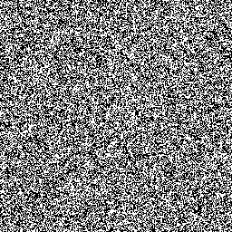

# Terms

## Randomness

A set of data that contains no recognizable patterns or regularities

{width=50%}

## Sample Space

An ordered list of unique possible outcomes of a given event with an associated level of probability.

This can be seen as a hash table.

\newpage

## Disjoint

Two events have no common outcomes however knowing the occurrence of event "A" sets the probability of event "B" to 0. Vice versa.

{width=50%}

## Independent

Two events that can occur at the same time but knowing the occurrence of event "A" does not change event "B". Vice versa.

## Sampling without Replacement

Remove an element from the dataset and remove a N amount of elements after without reintroducing previously removed elements.

These events are:

- **not** disjoint
- **independent**

## Sampling with Replacement

Remove an element from the dataset and immediately reintroduce the previously removed element.

These events are:

- **not** disjoint
- **not** independent

## Simulation

The act of emulating real life events in hopes to find the likelihood of said event.

\newpage

## Random Variables

Random variable is a variable whose numerical values describe outcomes of a random event

### Discrete

Probability mass function (PMF) places positive probability at specific numbers on the number line

### Continuous

Probability density function (PDF) places positive probability along a possibly infinite interval of the number line

\newpage

## Central Limit Theorem

In probability theory, the central limit theorem establishes that, in some situations, when independent random variables are added, their properly normalized sum tends toward a normal distribution even if the original variables themselves are not normally distributed

